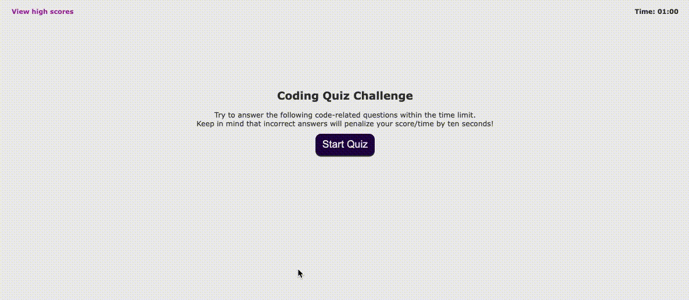

# Fernando Almeida - Timed-Quizlet.

## Purpose
A website that provides a quick way to test your knowledge on Javascript asking you quick questions about it.

## Built With
* HTML
* JS
* CSS

## Website
https://flalmeida3105.github.io/time-quizlet/

## About the Website
A website that provides a quick way to test your knowledge on Javascript asking you quick questions about it. It will add or remove points/time from your as you make right/wrong choices. 

The game will let you save your name at the end, either due to time constrains or because you responded all questions, then you compare the results with your friends.

On the top left, there will be a quick link to show the overall scores, and the highest three scores will be presented in green.

## Enjoy a quick overview of the website

## Contribution
Powered by Fernando Almeida